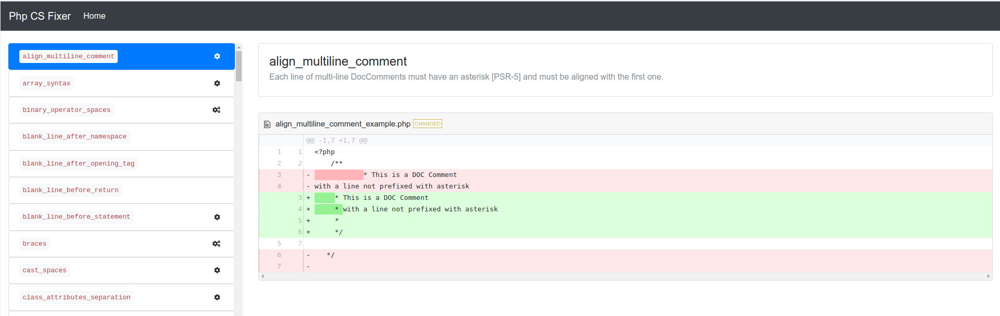

# Php CS Fixer Rules

https://mcampbell508.github.io/phpcsfixer-rules

The aim of this project is to provide a UI to help explain [PHP-CS-Fixer](https://github.com/FriendsOfPHP/PHP-CS-Fixer) rules, with clear examples. Personally, I think the official docs on the [README](https://github.com/FriendsOfPHP/PHP-CS-Fixer/blob/2.9/README.rst) are okay, but I felt there could be a better way to view what each rule does and demonstrate what happens after applying each rule.

Another reason for this project, is for me to learn more ReactJS.

Currently, with this application users can:

- Select each rule and view a clear description and if it is marked risky.
- When viewing a rule, a nice diff view for before and after demonstrations for each rule, once it is applied.

 

## Todos
- Make App fully responsive
- Handle multiple configuration rules
- Display the rule config for easy copy paste.
- Refactor with Redux, for own personal learning - if there is time

This project focuses on the rules specified in version `2.9.*` of PHP-CS-Fixer.

## Acknowledgements
- [PHP-CS-Fixer](https://github.com/FriendsOfPHP/PHP-CS-Fixer)
- [https://mlocati.github.io/php-cs-fixer-configurator/](https://mlocati.github.io/php-cs-fixer-configurator/) - I stumbled onto this interesting project when I had the idea to start my own project here. I have used [this JSON file](https://github.com/mlocati/php-cs-fixer-configurator/blob/master/docs/js/php-cs-fixer-data-2.9.0.json) from the php-cs-fixer-configurator project as part of my backend source which is sent to the React JS frontend. Check the project out, its pretty cool.

---

## Create React App

This project was bootstrapped with [Create React App](https://github.com/facebookincubator/create-react-app).

### Deployment

- [GitHub Pages](https://pages.github.com/)

## [License](./LICENSE)

MIT License